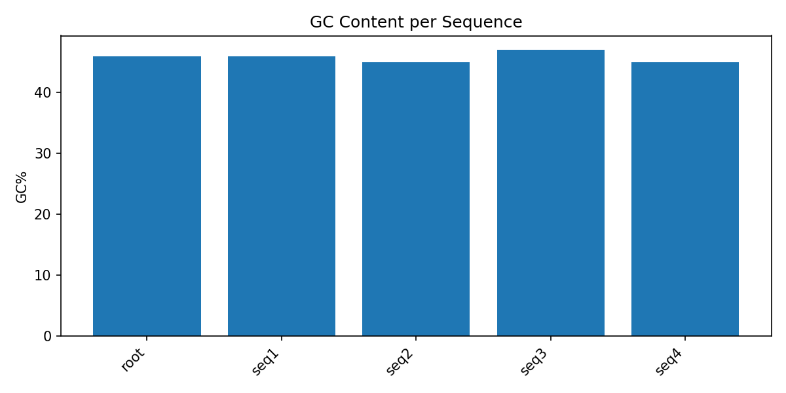
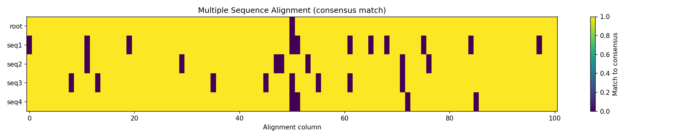
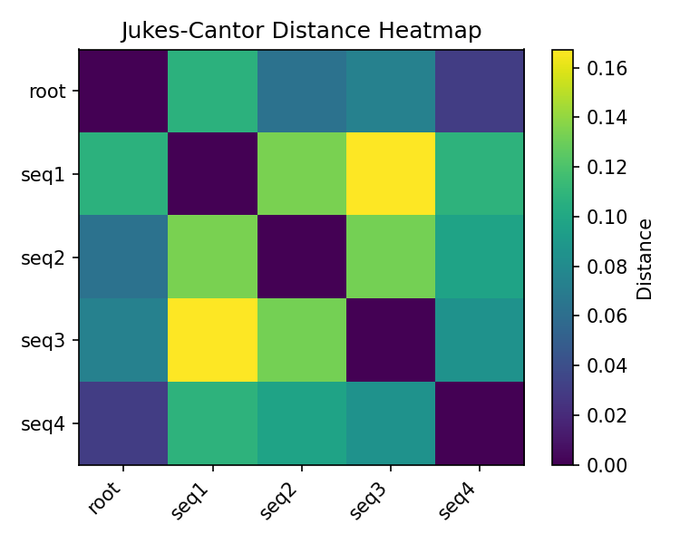
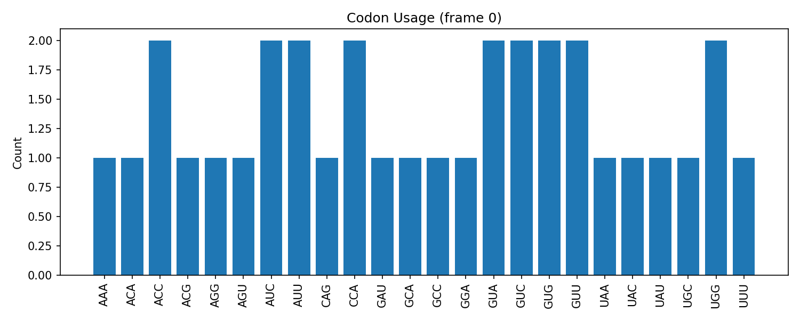
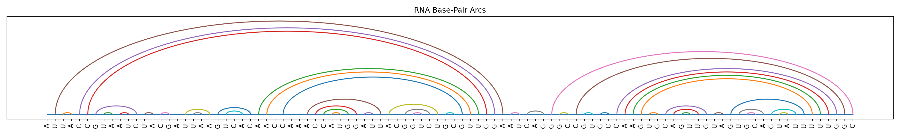

# Genetic Data Report

**Input FASTA:** `data/simulated_family/family4.fasta`  
**Sequences loaded:** 5

## 1. Base Composition
We plot GC% per sequence because GC content influences stability and can hint at species or genomic regions with bias.

## 2. Multiple Sequence Alignment (MSA)
We create a simple center-star MSA and visualize consensus agreement per column.

## 3. Pairwise Distances & Evolutionary Model
We compute raw p-distances and Jukes–Cantor-corrected distances (JC69).

## 4. UPGMA Gene Tree
We build an ultrametric UPGMA tree from JC69 distances and export Newick.

**Newick:** `tree.newick`

## 5. Codon Usage
Codon usage bias can reflect expression or tRNA availability; we show counts for the first sequence (frame 0).

## 6. RNA Secondary Structure (Nussinov)
We fold RNA and display dot-bracket and an arc diagram.

**Dot-bracket:** see `rna_structure.txt`  

---
*Generated by `report.py`.*
